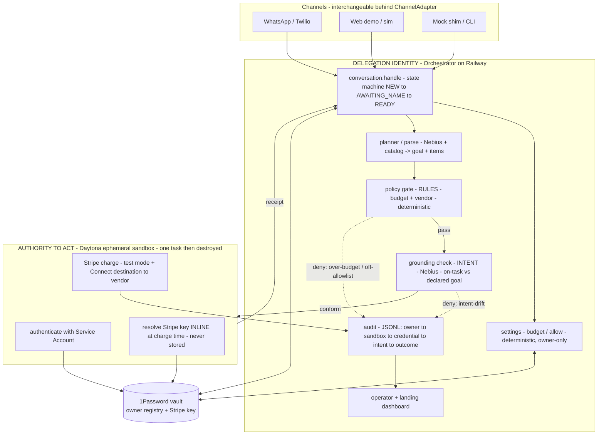

# Scopebound — Architecture at a Glance

*One-page map of how the system works, the special highlights, and the user flow.
Companion to `02_architecture/architecture.md` (the detailed version).*

## The thesis in one line

> The phone/identity proves **who delegated**; a 1Password credential resolved inside an
> ephemeral Daytona sandbox proves **authority to act**. They live in **separate trust
> domains** on purpose. A deterministic gate contains rule-breaking spend; an LLM **intent
> check** contains in-policy-but-off-task spend; an audit binds every action back to the human.

## High-level architecture

## What makes it special (the "so what")

- **Secretless agent.** The payment credential is resolved *inside the sandbox, at the moment
  of the charge*, and never touches the agent's context, disk, git, or logs. The verified
  workload *is* the credential (FR011/FR012).
- **Two physically separate trust domains.** *Who delegated* (identity, on Railway) and
  *authority to act* (1Password credential, in Daytona) never share scope. Remove either
  sponsor and the authority story collapses.
- **Containment is physical, not advisory.** A deterministic gate stops over-budget /
  off-vendor spend regardless of model output. The **intent grounding** stops the case rules
  can't see — in-budget, on-allowlist, but **off-task** (the espresso machine). That last beat
  is the unsolved frontier, made tractable because the goal is *declared*.
- **Owner-controlled policy.** Budget and allowlist are changed only by the verified owner over
  their verified channel, via a deterministic parser — the agent can never widen its own scope.
- **Full attribution.** Every action, allowed and denied, binds
  `owner → sandbox → credential_ref → intent → outcome`. The registry itself lives in the vault.
- **Real money, real vendors.** Stripe Connect destination charges route funds to the named
  vendor's connected account (test mode).

## User flow — what each step touches

| # | User does | What the system does | Aspect demonstrated |
|---|---|---|---|
| 1 | Texts anything (`CLAIM`) | Channel adapter + state machine provision a pending owner record | No app / no signup; identity = the channel |
| 2 | Replies a name | Second inbound **verifies** live control; owner persisted as a **1Password vault item** | Round-trip verify; identity lives in the vault |
| 3 | `budget 400` / `allow Acme, Staples` | Deterministic settings overwrite the owner's policy | Owner-controlled scope; agent can't self-widen |
| 4 | Delegates a task | Planner/parse builds a manifest (catalog + Nebius); declared **goal** persists | Intent is *declared* |
| 5 | (per item) | **gate** (budget+vendor) → **grounding** (on-task?) → on pass, a fresh **Daytona sandbox** resolves the Stripe key from **1Password** and charges via **Connect** → **audit** → sandbox destroyed | Both trust domains; secretless charge; real transfer |
| 6 | Over-budget / off-vendor / off-task item | Gate or grounding **denies** — no charge, audited, reason returned | Three layers of containment, incl. intent-drift |
| 7 | Returns later | Same identity recognized via the vault registry | Identity persists; phone = credential |
| 8 | (operator watches) | Three-up dashboard: chat · Stripe · audit | *Acting as you → it really spent → who answers* |

## Tech stack

Python · FastAPI on **Railway** · **Twilio** WhatsApp + web `/sim` · **Daytona** ephemeral
sandboxes · **1Password** SDK (Service Account) · **Stripe** test mode + Connect · **Nebius**
(Llama-3.3-70B) for task parsing + intent grounding · JSONL audit.
